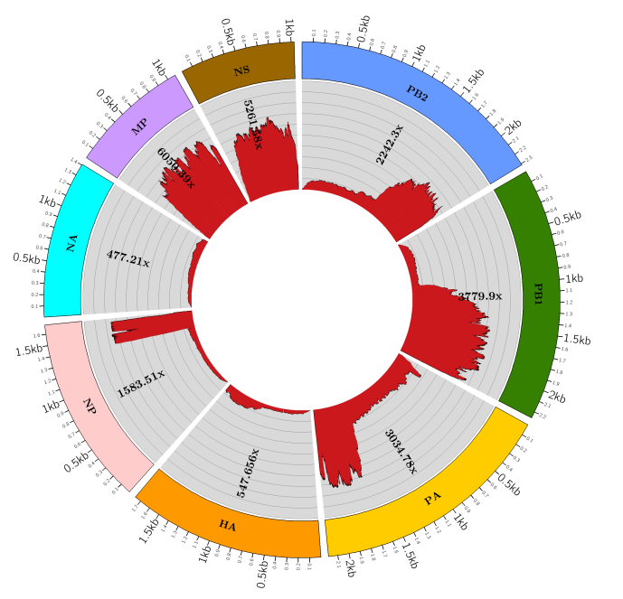

# IRMAsnk
Assembly, variant calling, and phasing of highly variable FLU viruses using IRMA and snakemake.

### phylogeny with/without downsampling per region.
`src/who_flu_irma.py` : Given multiple paired fastq files, the pipeline run a quality check (trimmomatic) and an assembly IRMA (e.g. `IRMA FLU-utr R1.fastq.gz R2.fastq.gz Sample1WithUTRs`). Next, it rename/group the results and create the depth plots using circos. 

**Input files:** (input1) Fastq folder with paired reads.

_Usage_:
`snakemake --snakefile who_flu_irma.py -j 48 --config ifq=/Data-RAID5/iseq/raw/illumina/iSeqRun8/ out=out_iseq/iSeqRun8_irma -np`

(-j number of cores; ifq fastq folder; -np dry run)

**Output files:** Assemblies and depth plots.

_Dependencies:_ [Trimmomatic](http://www.usadellab.org/cms/?page=trimmomatic), [IRMA](https://wonder.cdc.gov/amd/flu/irma/irma.html), [circos](http://circos.ca/), [FluDB database](https://www.ncbi.nlm.nih.gov/genomes/FLU/Database/nph-select.cgi?go=database)

**[!!]** _Considerations:_ (1) If no flu is detected in the fastq sample, it creates an empty file, to continue with the pipeline.

Pipeline coded using [Snakemake](https://snakemake.readthedocs.io/en/stable/) and make use of [Python3](https://www.python.org/) and [Biopython](https://biopython.org/).
